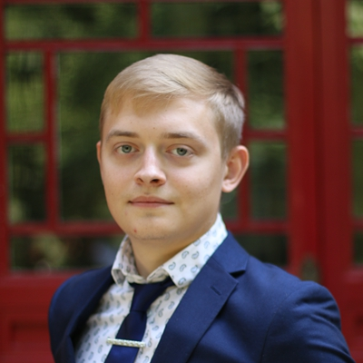

---
---
 

# Director of Academic Affairs
This Director represents students’ interests related to course selection, degree requirements, and academic conferences.
  

## 2019 Candidates

### Daniel Lewis Quirk -- 5th cohort

“I am applying for the role of Director of Academic Affairs to have a greater role in the Yenching Academy community and to facilitate communications of student concerns and issues to the Yenching administration.

Firstly I would like to play a greater role within the YCA community and I believe being a committee member of the GSU would be a perfect opportunity for me to do so while actively contributing to the development of the programme. I would like to use the role of Director of Academic Affairs to collect feedback on courses for next year’s students to access, as my cohort benefited greatly from a similar initiative by the 4th cohort. I also would like to make sure student feedback on courses is provided to the office so that recommendations could be made on how the student learning experience or particular courses could be improved for future students. As I am considering applying for TA/RA roles in my second year of Yenching, I believe this role will be a good introduction for these.

Secondly, I also would like to make sure student interests and concerns regarding their courses are made aware of so that methods can be proposed to overcome these. I have already worked in a similar role before which I believe makes me a strong candidate for this role. During my undergraduate studies I was a Student Representative for the Politics and International Relations Department’s first year students. In this role I gathered student responses to the department’s questions about how the student experience could be improved and then relayed this information back to the Department Affairs Committee so that we could discuss strategies to do so using the findings.”
  

### Yunzhi Liu -- 5th cohort

"Director of academic affairs is a fresh seat in a student union for me as these issues are always issued by the office to the student in a single direction. Since we students are the biggest subject of academic study in YCA, this position offers a chance for us to reverse the traditional way in which we students remain in the passive position and provides the chance to actively engage in the decision-making process of YCA academic affairs. 

We all could feel that YCA is still a young institute having abundant space to develop. China Studies is a subject broad enough to contain more opportunities and need more methods to get organized as well. With our work, we could express our opinions about the course content and academic research structure, which is important for YCA as a regional research program in nature and many of our friends wanting to pursuit academics in the long run.

The three main points of my further plan are as follow:

1. Establish an organized feedback system bridging the information gap between students, faculty and the office in order to improve the courses’ quality.

2. Improve the transparency of projects’ evaluation procedure. Clarify the details of different research programs, including the requirements of work at each stage and the reimbursement regulations. 

3. Connect the academic linkage between students from different cohorts by providing better platform for communication about further academic pursuits."