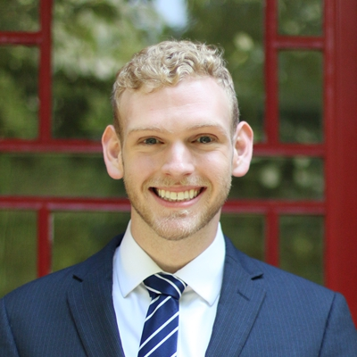

---
---

 

# Director of Events
This Director is responsible for organizing social and academic events, as well as publicizing PKU events and representing the YCA at broader campus-wide activities.
  

## 2019 Candidates

### Matthew Coffin -- 5th cohort

“Hi everyone! I’d be delighted to serve as the Director of Events for the upcoming year.

I’ve been amazed by the YCA community and its ability to unite scholars from diverse geographic and intellectual backgrounds. I’m sure many of us have experienced community in events like the Mid-Autumn Festival Celebration. I am running for the Director of Events in the spirit of community and unity.

Planning events ties directly to my past experiences; in college, I served as Yale’s equivalent of an RA. Beyond academic and emotional counseling, I created community through guided reflections, pancake nights, scavenger hunts, etc. As your Director of Events, I’ll build upon these experiences, developing new channels for deepening community.

If elected, I’d host events that connect students from all backgrounds. Here are some of my ideas:

- *International Spotlights.* To highlight the diversity of our cohort, the GSU will support students in planning events related to their home or identity. Students can celebrate while sharing their holidays and culture!
- *Small-Group Meals.* Students who sign up will be randomly assigned to groups of students from different backgrounds to grab a meal and learn about each other.
- *Biweekly events newsletter.* Rather than receiving scattered information from WeChat groups, I will email out a comprehensive list of upcoming student-planned events, both formal and informal.
- *Midterm/Finals Meditation Study Breaks.* We will provide refreshments and meditation sessions for students during the year’s busiest periods.

I’m pumped to get working on these events and many others. Thanks for your support!”