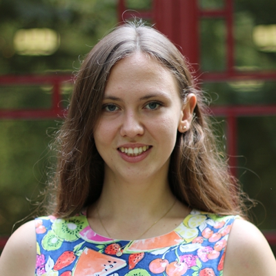
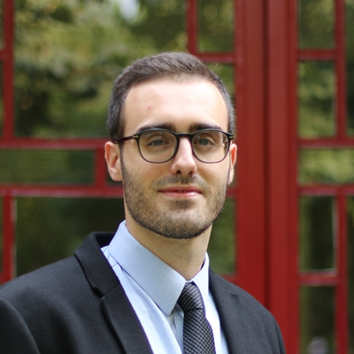

---
---

 

# Director of Operations
This Director is responsible for running the logistics of the GSU, such as communicating with the student body, taking GSU meeting minutes, publishing the GSU annual report, and managing the GSU’s finances.
  

## 2019 Candidates

### Natalia Jandzikova -- 5th cohort

“My name is Natalia Jandzikova, I am from Slovakia and my concentration at YCA is Politics and International studies. I‘ve been living in Beijing for almost 8 years and did my bachelors degree at Peking University School of International relations. Beijing is a familiar place for me and I speak Chinese fluently.

During my bachelor degree at PKU I have been President of Youth Association of Foreign Affairs, thus I have a lot of experience with managing of budget, logistics as well as I am very familiar with PKU regulations structure and offices. In the role of Director of Operations I hope I can improve coordination of GSU events, let GSU activities run more smoothly and promote new options in the field of logistics for YCA activities.”
  

### Daniel Horth Rojas -- 5th cohort

“I’d like to run for the position of Director of Operations. I’m going to work very hard to see a Graduate Student Union that always puts students at the forefront of every YCA activity and makes sure that they have the best possible experience here at Yenching. For this to happen, it’s necessary to have a Director of Operations that takes good care of the logistics aspect of student activities and communication. It’s not only important to closely listen to the student body, but to also actively create an environment where students can thrive. 

I’m a people person. From an early age I have been an active creator of projects and ideas, which have always been born out of my love of people and joy in my friendships. I think the contribution I can make to the GSU is my enthusiasm in a team, my ability to work hard and inspire my friends to do the same, and my openness and sincerity which allows me to work with others with a maximum of support and trust.”