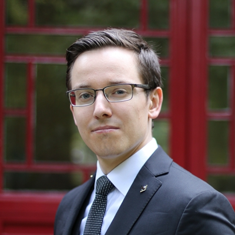
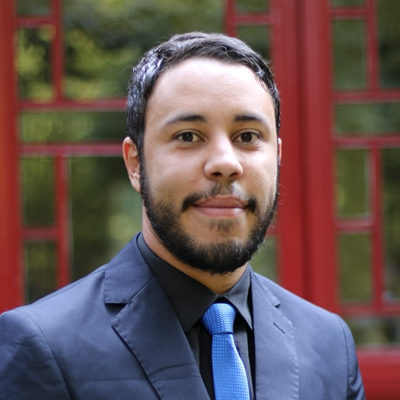

---
---

 

# Director of Public Relations
This Director is responsible for coordinating YCA administration, and social media team, and can recruit a team of public liaisons as needed.
  

## 2019 Candidates

### Michael Gritzbach -- 5th cohort

“Given my previous experience in journalism (The Harvard Crimson, The Columbia Daily Spectator), marketing (Frankfurt School of Finance & Management), and writing (The Harvard Crimson, Frankfurt School Student Blog), I am convinced that the GSU PR position is the place where I can use my skills and contribute the most to our Yenching community.

Especially my personal experience with information about Yenching is motivating me to apply for this position. Without the efforts of active scholars, who told me more about the program, I would have had a wrong impression about YCA and might not have applied. This is why I want to work with the office and the other scholars to improve the public visibility of our program, especially outside China, the information about the values we hold, and the presentation of the amazing personalities we have among us.

The specific plans I have include a “meet the scholars” format (inspired by the other China scholarship program across the street), contributing and organizing the media/yca website planned by the “Media” board at the moment, giving the student body more space to present itself (via YCA/GSU Instagram, FB, Youtube,…), and to establish communicative channels to foster productive cooperation between the scholars and the office while protecting the interest of the scholars.

Overall, I want to work with my fellow GSU members to improve YCA’s standing as global brand that is known and admired for its excellence, diversity, openness, and leadership.”
  

### Igor Patrick Silva -- 5th cohort

“Knowledge is only valid when it can be shared and impact people's lives in a positive way. Prior to applying for GSU's PR Director position, I wondered how I could use my skills to help spread the word about YCA's activities given my place at the Yenching Academy.

Indeed, the position requires technical expertise. Having worked as a professional journalist for six years and due to my communication-oriented academic background, I am thoroughly prepared for this role. I have worked for major media venues in Brazil, authored columns on foreign affairs for HuffPost Brazil and HuffPost Mexico, and acted as a special correspondent for RIA Novosti (news agency). During my Bachelors, I also worked for Estadão, one of the greatest newspapers in Latin America, where I learned several social media skills and SEO techniques.

But it takes more than managing social media and mastering photography and filming techniques. Being GSU's director of PR means acting as a representative for the off-campus community. This includes the media, but also our networking in our countries. Therefore, I intend to complete this work with the help of all scholars by creating outreach videos in each respective language that will help YCA attract more applications from overseas students and develop strategic partnerships with other degree programs.

In addition, the spectacular work done by my colleagues needs to be recognized outside the university. My proposal is to transform the public relations board also into a space for the dissemination of initiatives by all scholars, contributing to their professional, academic and personal trajectories.”