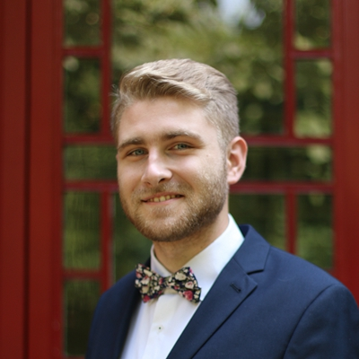
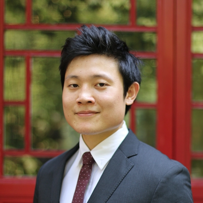
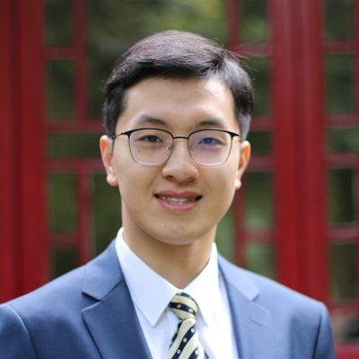
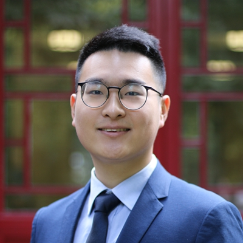

---
---
 

# Vice President
The Vice President assists the President and serves as a secondary representative, and helps address the needs of the students body.
  

## 2019 Candidates

### Flavian Berneaga -- 5th cohort

"Running for the GSU vice-presidency will be for me a new book, just as much as it will be a new chapter, given my previous spells in student governance over the past three years. While at the University of Toronto, I was elected twice as president of the European Studies Students’ Association, being responsible for a body of ⁓100 students in the undergraduate program. That is when I really learned to be flexible between organizing academic events with ambassadors, overseeing the publication of our student journal, gathering a soccer team, or just laying out pub nights. Later on, at KU Leuven, I was chosen to be the student representative of the master’s program, meaning I heard the students’ complaints, and streamlined them to the Steering Committee composed of professors and administration in order to be solved.

These past positions taught me a great deal about communication and flexibility, and as the saying goes, “if it ain’t broken, don’t try to fix it”. I intend to bring these same values to the GSU, both within the executive, where problems need to be solved as a team, and within the student body, for whom I intend to have weekly meetings where students can bring up their concerns, then solve them with the executive and the office. Equally, I know that sensitive issues require private ears, so I intend to be the element of trust and objectivity that seeks the middle ground."
  

### Kenneth He -- 5th cohort

“From the very beginning, one of my goals at YCA was to contribute to the community that I now call home. Among the multiple ways of contribution, it is at the GSU where I believe my skills and experience are most valuable. Having served in representative organisations such as the Australia China Youth Association , Australia China Business Council and managed an international conference, I have extensive experience with leadership, management and diplomacy.

If selected, Michael Lee and I will focus on the values which are present in Articles: 1, 2, 3, 4 and 5 of the constitution; simplified as **representation, facilitation, cultural understanding, community and support.**

1. An accessible alumni network for current students creates a community not just for the year, but after graduation as well. As future alumni, it is my hope that the legacy of this reform will benefit all YCA scholars past, present and future.
2. In an effort to bring Yenching closer to the wider PKU community, the GSU must make the effort to host more inter-PKU mixer events for cultural understanding. Building from last year’s GSU, we will expand on the communal activities to organising YCA volunteer trips during the winter vacation and on weekends.
3. Finally, I want to reform guidelines on academics and extracurricular activities at YCA more transparent and flexible. The GSU should endeavour to streamline the orientation guide, make the criteria for club applications and funding more supportive, and revamp the extracurricular point system.

__*Ken He do it? Yes He Ken!”*__
  

### Weishen Zeng (Derek) -- 5th cohort

“What does it mean to be the Vice President? My understanding of VP position is that it not only stands for a second representative of this community but a coordinator who is willing to connect with different groups and turn great ideas into reality. And ideas are only accessible when it can be managed and implemented.

It requires not only experience but patience. Having worked as the President of Student Union of my undergraduate school in Renmin University of China, I understand how to cooperate with the administration under Chinese political framework as well as get the things done efficiently. At the same time, I have worked as the representative in the Student Council of RUC, where I collected the opinion and ideas from more than 2000 students and proposed resolutions approved by the university.

It is my experience of being an exchange student at Columbia University that gives me a multi-cultural background so that I could understand how to listen to people share different value. My experience in international events such as Oxford Model United Nations 2018 offered me a sense that international cooperation, not matter the official one or that in our daily life, requires not only communication skills, but courage, commitment, and patience.

Running with Jonah, who has more experience in peer advising, is another advantage. We believe Dialogue matters because it gives people the opportunity to exchange ideas and experiences. We also have accessible plans and initiatives for career activities where scholars will be encouraged to exchange information with alumni, NGOs, private sector and other institutions. The idea of broader community engagement and service is another shining point. We will create opportunity for YCA scholars to make more voice in University affairs as well as Beijing student network.

I am open to ideas, practice and advice. For me, the GSU election is more like a chance to exchange ideas than just try to win the support of people. The talented scholars in this community have inspired me so much and it would be an honor for me to cooperate with them!”
  

### Yu Songqi (Jacky) -- 5th cohort

“It is my belief that GSU of Yenching Academy can be defined as a “bridge” that is built between YCA and PKU, YCA and the office, and among Yenching Scholars, and it is a bridge that need someone who can ensure its sustainability and smoothness. Therefore, my motivation for applying is that as a pragmatic and detail-oriented individual, I am willing to put efforts in various event operations, communications, and outreaches that could improve our bridge to create a sustainable Yenching that connect everyone, their past, present, and future.

If chosen as the Vice-President of GSU, I would like to focus on two aspects during the tenure: pragmatic event organization and inclusive participation. Firstly, as an experienced event planner, I will assist the President and the Director of Events in initiating, overseeing and monitoring the event operations at GSU those would benefit the bridge-building of GSU, such as YCA-PKU social event and YCA interest group. Besides, as a Chinese scholar, I will assist my GSU members in deepening the communication between international and Chinese students and across cohorts by organizing activities that “works for everyone”.”
